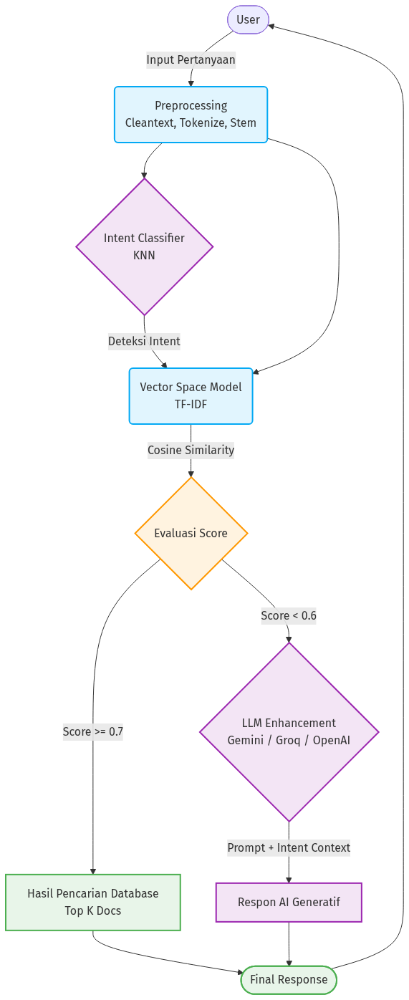
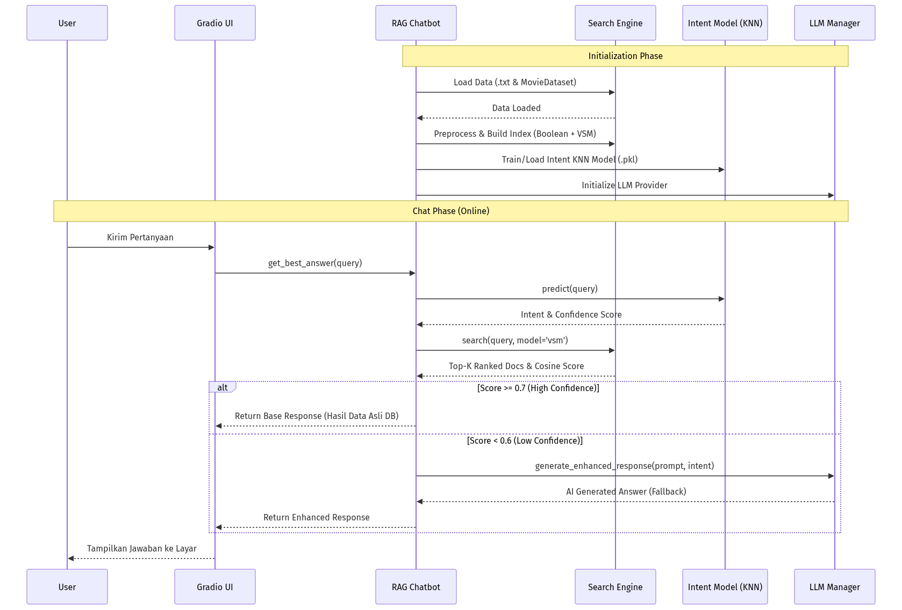
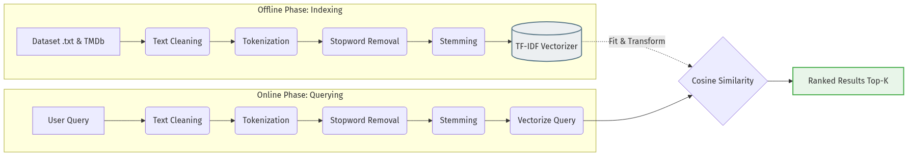

# Visualisasi Sistem Chatbot Film RAG

Berikut adalah visualisasi arsitektur RAG (Retrieval-Augmented Generation), alur kerja (workflow), dan pipeline retrieval yang diimplementasikan pada proyek Chatbot Film Anda berdasarkan *source code* (khususnya `chatbot.py`, `search_engine.py`, dan `llm_integration.py`).

---

## 1. RAG Architecture Diagram
Sistem ini menggunakan pendekatan RAG bersyarat. Jika tingkat relevansi pencarian (Cosine Similarity) berada di atas *threshold*, sistem akan mengembalikan data teks asli dari corpus. Namun, jika pencocokan berada di bawah *threshold* (hasil kurang meyakinkan), sistem akan melakukan *fallback* dengan memanggil model LLM (seperti Gemini, OpenAI, atau Groq) untuk menjawab berdasarkan *intent* dan *query* secara generatif.

---

## 2. System Workflow (Sequence Diagram)
Diagram ini menggambarkan alur kerja sistem, dimulai dari fase inisialisasi aplikasi (memuat data dan membangun index) hingga interaksi langsung dengan pengguna (Chat Phase) yang diatur menggunakan antarmuka UI Gradio.

---

## 3. Retrieval Pipeline
Pipeline ini memecah alur *Information Retrieval* yang terjadi di bawah kap mesin `search_engine.py`. Ia memisahkan *offline phase* (proses data sebelum pencarian) dan *online phase* (memproses pertanyaan saat runtime).

